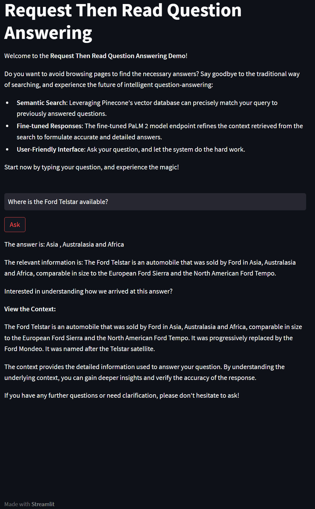

# Retrieval Augmented Generation for Question Answering

## Description

This application is designed to help customer service organizations respond to user queries. Instead of having customer representatives manually address each question, this solution automates the process using a combination of semantic search and the power of a large language model (LLM).

### What it Does:
This application serves as a dynamic FAQ service by matching a new user's query to a historical one from a database of historical customer resolutions. Once matched, the application employs a large language model trained on this dataset to provide an accurate, context-rich answer.

Although this demo doesn't leverage customer service data, I've incorporated the `databricks-dolly-15k` dataset from Databricks as a prototype. It is designed with document question-answering tasks in mind.



### Why These Technologies?
- **all-MiniLM-L6-v2 Model**: Chosen from Hugging Face's `sentence-transformers` library for sentence embedding due to its stellar performance in semantic search quality rankings and efficiency.
- **Pinecone Vertex Database**: Utilized for storing sentence embeddings and conducting cosine similarity lookup for new queries. The decision to go with Pinecone was driven by its ease of implementation, capability to store metadata alongside vector embedding, and superior storage capabilities compared to Spotify's `annoy` library.
- **Google Cloud Platform's Vertex AI**: Used for the PaLM 2 LLM due to its user-friendly capabilities to fine-tune, deploy models as endpoints, and integrate models into a larger MLOps framework.
-**Streamlit**: Used to make a quick app deployment.

### Challenges:
A significant hurdle was the prolonged duration to fine-tune the Llama 2 7b model using QLoRA with Hugging Face's `trl` library on a single Nvidia L4 GPU. Despite attempts to expedite the process using PEFT, it remained time-consuming.

### Future Implementations:
Given the challenges encountered, future work is directed at distributed training of the Llama 2 model within a containerized pipeline using Kubeflow. This approach will ensure efficient and scalable model training.

### Dive Deeper:
Please refer to the `example.ipynb` Jupyter notebook in this repository for those interested in the development journey and a step-by-step breakdown.

## Installation and Running Instructions

### Setting up the Environment:

1. **Google Cloud Platform (GCP) Setup**:
    - Set up a GCP Compute Engine VM with an Nvidia T4 GPU to ensure the sentence embedding has GPU access for optimized performance.
    - Ensure your VM can access the `cloud.aiplatform` API.

2. **Installation**:
    - SSH into your VM.
    - Clone the repository: 
      ```bash
      git clone https://github.com/JamesFCoffey/RTR-Document-QA.git
      cd RTR-Document-QA
      ```
    - Install the necessary dependencies:
      ```bash
      pip install -r requirements.txt
      ```

### Fine-Tuning on New Data:

1. **Quota Increase**:
    - Request an increase in your quota on GCP.
        - For `us-central1`: Ensure availability of eight A100 80GB GPUs.
        - For `europe-west4`: Confirm access to 64 cores of the TPU v3 pod custom model training resource.

2. **Fine-Tuning**:
    - Open the `experiment.ipynb` notebook to fine-tune new data:
      ```bash
      jupyter notebook experiment.ipynb
      ```
    - Proceed with distributed fine-tuning of PaLM 2 on Vertex AI as per the descriptions in the notebook.

### Setting Up the Application Service:

1. **New VM Setup**:
    - Start a new VM on GCP without a GPU to host the service using Streamlit. 
    - Set its external IP address as static. This is essential to ensure consistent access.
    - Modify firewall settings for the instance to allow access through TCP port 8501. Detailed instructions can be found [here](https://towardsdatascience.com/running-jupyter-notebook-in-google-cloud-platform-in-15-min-61e16da34d52) on how you would do this for a Jupyter notebook, but an equivalent setup applies here.

2. **Configuration & Running**:
    - SSH into the new VM.
    - Install the requirements:
      ```bash
      pip install -r requirements.txt
      ```
    - Modify `config.yaml` with your appropriate values.
    - Launch the app:
      ```bash
      streamlit run app.py
      ```
    - Navigate to the app in your browser using:
      ```
      <static-external-ip>:8501
      ```
